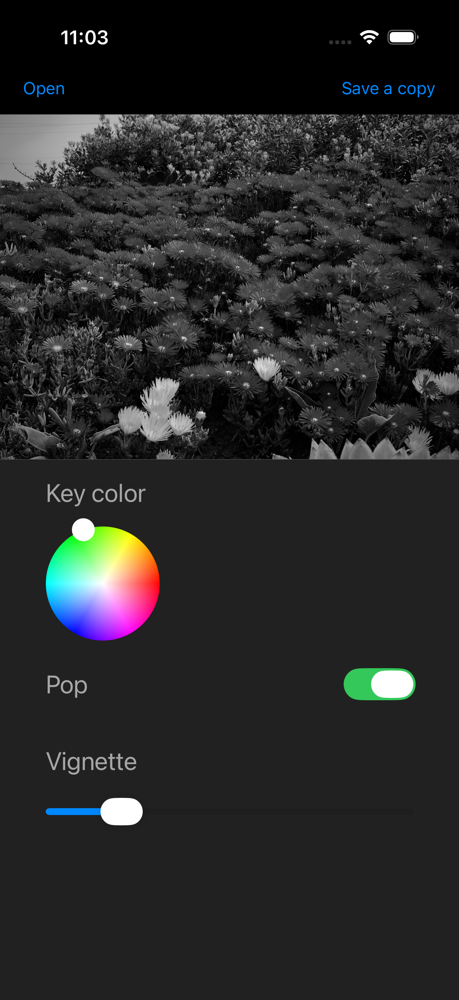
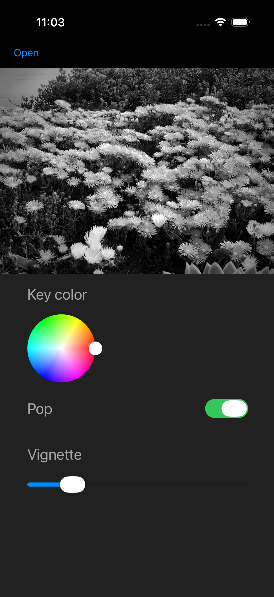

## Easy Black and White

### Map colors to black and white

Use the color wheel to choose which color becomes lightest in the black and white version.

Red often works well for portraits.

The flowers in this field disappear when you choose green…

…and become bolder when you choose red.

### Extension

In the Photos app, tap the (...) button while editing a photo. Tap Extensions.

Select the Easy B&W extension.

### Support

This product is offered as-is without warranty of any kind, express or implied. If you have a question or suggestion, please reach out to me at horizon.five.software at gmail.com and I'll do my best to respond.
